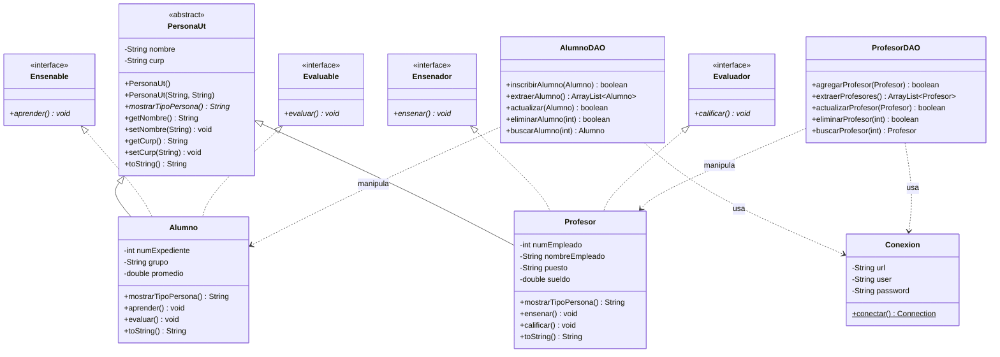

<div align="center">

# 🐺 SISTEMA COMUNIDAD UNIVERSITARIA | POLIMORFISMO E INTERFACES 🐺
### *Arquitectura Orientada a Objetos & Persistencia JDBC en MySQL*
**`Universidad UT` • `Actitud Lobo`**

[](https://www.oracle.com/java/)
[](https://www.mysql.com/)
[](https://maven.apache.org/)
[](https://github.com/)
[](https://github.com/)

---

```text
  ____ ___  __  __ _   _ _   _ ___ ____    _    ____     _   _ _____ 
 / ___/ _ \|  \/  | | | | \ | |_ _|  _ \  / \  |  _ \   | | | |_   _|
| |  | | | | |\/| | | | |  \| || || | | |/ _ \ | | | |  | | | | | |  
| |__| |_| | |  | | |_| | |\  || || |_| / ___ \| |_| |  | |_| | | |  
 \____\___/|_|  |_|\___/|_| \_|___|____/_/   \_\____/    \___/  |_|  
                  🐾 ACTITUD LOBO • INGENIERÍA 🐾
```

</div>

---

## 📋 Ficha Técnica & Datos Académicos

| Campo | Información |
| :--- | :--- |
| 👨‍🎓 **Estudiante / Desarrollador** | **Kurt Cobain Vázquez Sánchez** |
| 👨‍🏫 **Profesor / Asesor** | **René Santos Osorio** |
| 🏛️ **Institución** | Universidad Tecnológica (UT) |
| 🐺 **Identidad Universitaria** | **Actitud Lobo** |
| 📚 **Materia / Área** | Programación Orientada a Objetos & Gestión de Bases de Datos |
| 🧩 **Patrón Arquitectónico** | DAO (*Data Access Object*) + MVC Modular (Vista / Modelo / Config / DAO) |
| 🔌 **Tecnologías** | Java SE 21+/26, JDBC (*MySQL Connector/J 9.7.0*), Apache Maven, MySQL Server |

---

## 🌟 Descripción del Proyecto

El **Sistema Comunidad Universitaria** es una solución de software desarrollada en Java que modela la estructura académica de la **Universidad UT**. Este proyecto implementa de manera rigurosa los cuatro pilares fundamentales de la Programación Orientada a Objetos: **Abstracción, Encapsulamiento, Herencia y Polimorfismo**, complementados con el diseño e implementación de **Interfaces de Comportamiento**.

A través de una arquitectura desacoplada y escalable, el sistema gestiona de manera homogénea a los **Alumnos** y a los **Profesores**, tratándolos como miembros de la superclase abstracta `PersonaUt`, mientras que cada entidad implementa contratos específicos (`Ensenable`, `Ensenador`, `Evaluable`, `Evaluador`) para reflejar sus roles institucionales.

```text
                              ┌─────────────────┐
                              │    PersonaUt    │ (Clase Abstracta)
                              └────────┬────────┘
                                       │
                    ┌──────────────────┴──────────────────┐
                    ▼                                     ▼
        ┌───────────────────────┐             ┌───────────────────────┐
        │        Alumno         │             │       Profesor        │
        ├───────────────────────┤             ├───────────────────────┤
        │ ⬡ Ensenable (aprender)│             │ ⬡ Ensenador (ensenar) │
        │ ⬡ Evaluable (evaluar) │             │ ⬡ Evaluador(calificar)│
        └───────────────────────┘             └───────────────────────┘
```

---

## 🚀 Características Principales

- 🌐 **Comunidad Universitaria Polimórfica:** Colección unificada `ArrayList<PersonaUt>` que extrae simultáneamente alumnos y profesores desde MySQL y los renderiza dinámicamente mediante enlace tardío (*Late Binding*).
- 📐 **Interfaces de Roles Académicos:**
  - `Ensenable`: Define la capacidad de adquirir conocimiento (`aprender()`).
  - `Ensenador`: Define la capacidad de impartir cátedra (`ensenar()`).
  - `Evaluable`: Define el proceso de someterse a evaluación (`evaluar()`).
  - `Evaluador`: Define la facultad de emitir calificaciones (`calificar()`).
- 🛡️ **Validación de Datos Rigurosa:** Encapsulamiento con validación en tiempo de ejecución (CURP de 18 caracteres alfanuméricos, cadenas no vacías y promedios válidos).
- 🗄️ **Persistencia Robusta (DAO Pattern):** Capa de acceso a datos independiente con sentencias preparadas (`PreparedStatement`) para prevenir inyecciones SQL.
- 🖥️ **Interfaz de Menús Jerárquicos y Modulares:**
  - **Menú General:** Vista global de la comunidad y enrutamiento a subsistemas.
  - **Menú Alumnos:** CRUD completo para el alumnado (`MenuAlumno`).
  - **Menú Profesores:** CRUD completo para el personal docente (`MenuProfesor`).

---

## 🏗️ Diagrama de Clases & Arquitectura



---

## 📊 Matriz de Operaciones CRUD

| Entidad | Inscribir / Crear (`INSERT`) | Consultar General (`SELECT`) | Buscar Individual (`WHERE`) | Actualizar (`UPDATE`) | Eliminar (`DELETE`) | Polimorfismo |
| :--- | :---: | :---: | :---: | :---: | :---: | :---: |
| **Alumno** | ✅ | ✅ | ✅ | ✅ | ✅ | ✅ (`PersonaUt`) |
| **Profesor** | ✅ | ✅ | ✅ | ✅ | ✅ | ✅ (`PersonaUt`) |
| **Comunidad UT** | — | ✅ *(Polimórfico)* | — | — | — | ✅ *(Unificado)* |

---

## 🗃️ Script de Base de Datos (MySQL)

```sql
-- Creación de la base de datos
CREATE DATABASE IF NOT EXISTS universidadUt1 CHARACTER SET utf8mb4 COLLATE utf8mb4_unicode_ci;
USE universidadUt1;

-- Tabla de Alumnos
CREATE TABLE IF NOT EXISTS alumnos (
    numExpediente INT PRIMARY KEY,
    nombre VARCHAR(100) NOT NULL,
    curp VARCHAR(18) NOT NULL UNIQUE,
    grupo VARCHAR(20) NOT NULL,
    promedio DOUBLE NOT NULL
);

-- Tabla de Profesores
CREATE TABLE IF NOT EXISTS profesores (
    numEmpleado INT PRIMARY KEY,
    nombre VARCHAR(100) NOT NULL,
    curp VARCHAR(18) NOT NULL UNIQUE,
    nombreEmpleado VARCHAR(100) NOT NULL,
    puesto VARCHAR(50) NOT NULL,
    sueldo DOUBLE NOT NULL
);

-- Datos iniciales de prueba (Actitud Lobo)
INSERT INTO alumnos (numExpediente, nombre, curp, grupo, promedio) VALUES 
(1001, 'Kurt Cobain Vazquez', 'VASQ010203HDFRRN01', 'TI-91', 9.8),
(1002, 'Ana Paula Ramirez', 'RAMA020512MDFRRZ02', 'TI-91', 9.5);

INSERT INTO profesores (numEmpleado, nombre, curp, nombreEmpleado, puesto, sueldo) VALUES 
(2001, 'Rene Santos Osorio', 'SAOR750815HDFRRL09', 'Rene Santos Osorio', 'Profesor', 25000.00);
```

---

## 📂 Estructura del Proyecto

```text
UniversidadUT/
├── pom.xml                                   # Configuración de dependencias Maven
└── src/
    └── main/
        └── java/
            └── org/
                └── example/
                    ├── Main.java             # Clase principal de arranque
                    ├── config/
                    │   └── Conexion.java     # Singleton de conexión JDBC
                    ├── dao/
                    │   ├── AlumnoDAO.java    # Operaciones CRUD para Alumnos
                    │   └── ProfesorDAO.java  # Operaciones CRUD para Profesores
                    ├── modelo/
                    │   ├── PersonaUt.java    # Superclase abstracta base
                    │   ├── Alumno.java       # Entidad Alumno + Interfaces
                    │   ├── Profesor.java     # Entidad Profesor + Interfaces
                    │   ├── Ensenable.java    # Interface: aprender()
                    │   ├── Ensenador.java    # Interface: ensenar()
                    │   ├── Evaluable.java    # Interface: evaluar()
                    │   └── Evaluador.java    # Interface: calificar()
                    └── vista/
                        ├── MenuGeneral.java  # Menú principal & vista polimórfica
                        ├── MenuAlumno.java   # Submenú específico de Alumnos
                        └── MenuProfesor.java # Submenú específico de Profesores
```

---

## ⚡ Guía de Instalación y Ejecución

### 1. Clonar el repositorio
```bash
git clone https://github.com/tu-usuario/sistema-comunidad-universitaria-polimorfismo.git
cd sistema-comunidad-universitaria-polimorfismo/UniversidadUT
```

### 2. Configurar la base de datos
Edita `src/main/java/org/example/config/Conexion.java` con tus credenciales de MySQL:
```java
private static final String url = "jdbc:mysql://localhost:3306/universidadUt1";
private static final String user = "root";
private static final String password = "tu_password";
```

### 3. Compilar y Ejecutar con Maven
```bash
# Compilar proyecto y descargar dependencias
mvn clean compile

# Ejecutar la aplicación
mvn exec:java -Dexec.mainClass="org.example.Main"
```

---

## 💻 Demostración del Menú en Consola

```text
========== MENU GENERAL ==========
1.- Mostrar Universidad UT
2.- Menu Profesores
3.- Menu Alumnos
4.- Salir
Seleccione una opcion: 1

===== COMUNIDAD UNIVERSITARIA =====
Tipo de Persona: Alumno
Nombre: Kurt Cobain Vazquez
Curp: VASQ010203HDFRRN01
Num Expediente: 1001
Grupo: TI-91
Promedio: 9.8

Tipo de Persona: Profesor
Nombre: Rene Santos Osorio
Curp: SAOR750815HDFRRL09
Num Empleado: 2001
Puesto: Profesor
Sueldo: $25,000.00
```

---

<div align="center">

### 🐺 ¡Orgullo y Excelencia Académica con Actitud Lobo! 🐺
Desarrollado con dedicación y buenas prácticas de ingeniería de software.

**Universidad Tecnológica • 2026**

</div>
